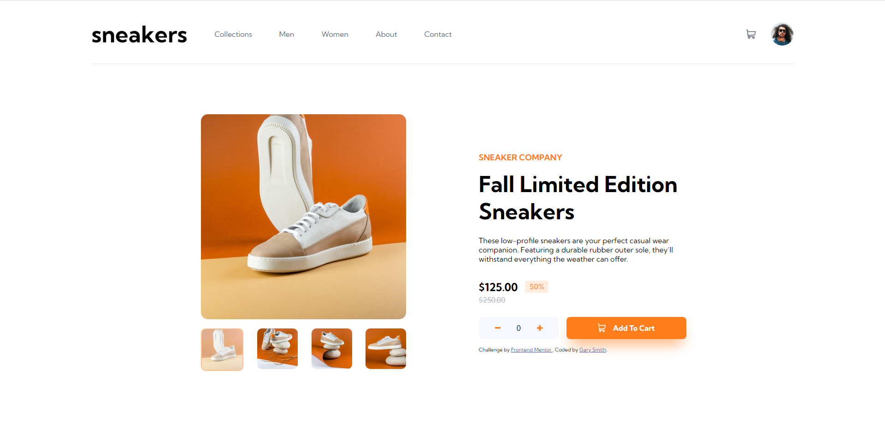

# Product Page

**Link to project:** https://statuesque-scone-4a10f4.netlify.app

## How It's Made:

**Tech used:** HTML, CSS, Javascript

This project can be found on frontend mentor.

The goal of this project was to code out the figma design of the application, while I could have used react or other libraries to pull this off, I wanted to give myself a refresher by sticking to the basics. 

Some of the key features of the application include, being able to view, add and remove items from the cart, switching product image when clicking on small thumbnails, lightbox gallery that is shown when user clicks on large product image, etc.

## Lessons Learned:
• I learned how to change the source photo of images using Javscript.
• You can inspect the figma design to get stlying specifications such as color, height, etc.

